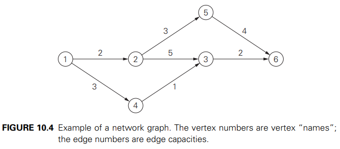
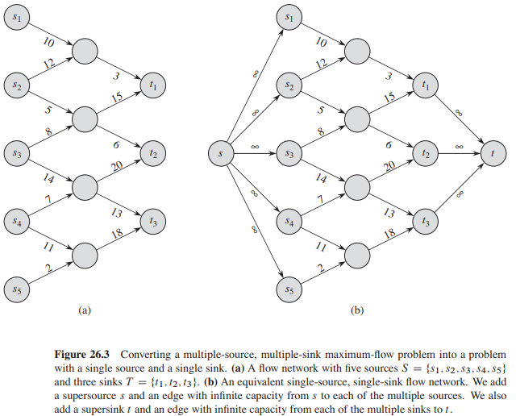

# Problema do Fluxo Máximo

De forma bem geral, o problema do fluxo máximo busca maximizar o fluxo de materiais através de uma rede de transporte [1]. Tal rede costuma ser representada através de um dígrafo conexo com as seguintes propriedades:

- Existe um vértice de entrada chamado de _fonte_ (_source_), do qual não existe arestas chegando nele.
- Existe um vértice de saída chamado de _sorvedouro_ (_sink_), que não possui arestas saindo dele.
- Para cada aresta direcionada $(i, j)$ existe um inteiro $c(i,j)$, chamado de _capacidade_, associado com essa aresta. A capacidade representa o máximo de material que pode ser transportado por essa aresta.

## Redes de Fluxos e Fluxos em Grafos

Formalmente, um grafo direcionado $G = (V, E)$ no qual para toda aresta $(u, v) \in E$ existe uma capacidade $c(u, v) \geq 0$ é chamado de _rede de fluxo_ (ou simplesmente _rede_) [2] se satisfaz as seguintes propriedades:

- Se $(u, v) \in E$, então $(v, u) \notin E$.
- Se $(u, v) \notin E$, então $c(u,v) = 0$.
- $G$ não possui laços.
- Existe um vértice $s$ chamado fonte.
- Existe um vértice $t$ chamado sorvedouro.
- Todos os outros vértices $v \in V - \{s, t\}$ fazem parte de um $st$-caminho.

Nesse contexto, um fluxo no grafo $G$ é uma função $f: V \times V \to \mathbb{R}$ que satisfaz duas propriedades:

1. Capacidade: Para todo $u, v \in V$, temos que $0 \leq f(u,v) \leq c(u,v)$.
2. Conservação do fluxo: Para todo $u \in V - \{s, t\}$, temos que $\sum\limits_{v\in V} f(v, u) = \sum\limits_{v\in V} f(u, v)$.
- OBS:. quando $(u, v) \notin E$, então $f(u,v) = 0$ já que não pode existir fluxo sem uma aresta.

O valor (_value_), ou saldo, de um fluxo $f$, denotado por $|f|$, é definido da seguinte forma: $|f| = \sum\limits_{v\in V}f(s,v) - \sum\limits_{v\in V}f(v, s)$. Visto que, normalmente, não existem arestas chegando na fonte $s$, o segundo termo é $0$. Entretanto, o segundo termo é importante na definição das redes residuais.

## Múltiplas entradas/saídas

Existem cenários que possuem múltiplas fontes $\{s_1, s_2, \dots, s_m\}$ e múltiplos sorvedouros $\{t_1, t_2, \dots, t_n\}$. Apesar de parecer uma tarefa complexa, podemos reduzir tais problemas em problemas que possuem uma única fonte e um único sorvedouro utilizando _supersource_ e _supersink_.

Nesse cenário, criamos uma nova fonte $s$, chamada de _supersource_, que possui arestas para cada uma das fontes originais $s_i$ com capacidade $c(s, s_i) = \infty$. Analogamente, criamos um novo sorvedouro $t$, chamado de _supersink_, que possui arestas chegando de cada um dos sorvedouros originais com capacidade $c(t_i, t) = \infty$.

## Definição formal: Fluxo Máximo

> Dado um grafo de rede $G$, encontre um fluxo $f$ tal que $|f|$ é máximo. Em outras palavras, encontrar $\argmax\limits_{f} |f|$.

# Procedimento Ford-Fulkerson

Alguns autores consideram que esse algoritmo/procedimento utiliza uma estratégia gulosa (_greedy_) [4], enquanto outros classificam como uma estratégia _iterative improvement_ [1]. De qualquer forma, ambos convergem na estrutura geral do algoritmo.

# Algoritmo Edmond-Karps

TODO: Descrição do algoritmo Edmond-Karps e seu pseudo-código.

# Referências

- [1] Levitin, A. Introduction to the Design and Analysis of Algorithms (2011).
- [2] Cormen, Introduction to Algorithms (2009).
- [3] https://en.wikipedia.org/wiki/Ford%E2%80%93Fulkerson_algorithm
- [4] https://www.cs.cmu.edu/~avrim/451f08/
- [5] http://www.cs.cmu.edu/~15451/